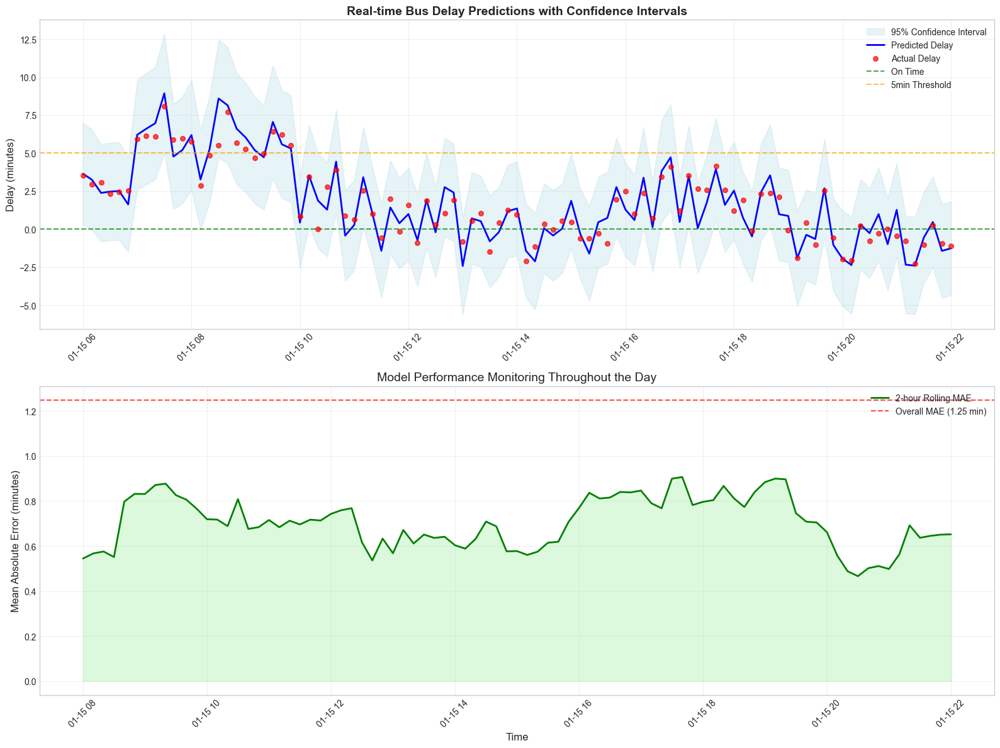
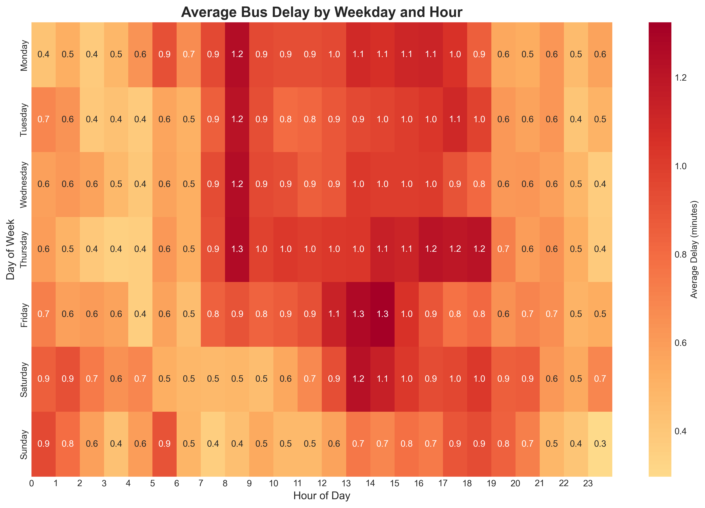
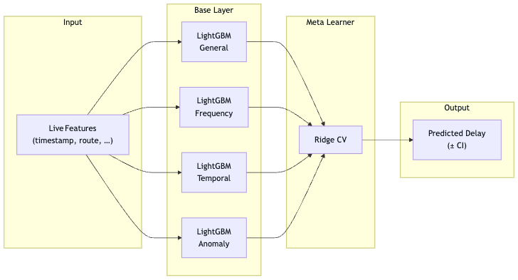

# KVG Time Series Prediction

Advanced ensemble model for predicting bus delays using time series analysis and machine learning.

## Features

- Specialized models for different bus routes and patterns
- Historical patterns, rolling statistics, and lag features (Time series features)
- Combines multiple LightGBM models with meta-learning
- Identifies unusual delay patterns (anomalies)
- Fast inference with confidence intervals (in real time)

## Results



This is the result of train_model.py with MAX_RECORDS = 3_000_000; STACKING_LEARNER_MAX_SAMPLES = 100_000:

```
[...]
============================================================
 TRAINING PIPELINE COMPLETED SUCCESSFULLY!
============================================================
 Final Model Performance:
   R^2 Score: 0.6398
   MAE: 0.809 minutes
   Model saved to: models/kvg_ensemble_model.pkl
```

The measurements can differ. For example the chart above used only n = 50_0000 rows of data. So the MAE is bigger in the chart.

## Raw Dataset (Prior Processing)

I scraped the data from the web over a period of months by querying all stops in Kiel every 15 minutes and saving the results in a .csv file.
Therefore the complete dataset is private.

But this is a little snippet of the used data. The data, which is used to train the models, has a range of 8 months and several million lines of data.
| timestamp | busStopID | stopName | patternText | direction | actualTime | plannedTime | status | routeId | tripId | vehicleId |
|---------------------|-----------|------------------------------|--------------|--------------|------------|-------------|------------|----------------------|----------------------|------------------------|
| 2024-12-18 18:32:17 | 1020 | Heikendorf, Am Heidberg | 15 | Mettenhof | 18:52 | 18:52 | PREDICTED | 1610073983892324384 | 1610077840787696906 | -7638104967705910578 |
| 2024-12-18 18:32:17 | 1005 | Belvedere | 13 | Kiel Hbf | 18:33 | 18:33 | PREDICTED | 1610073983892324382 | 1610077840787574030 | -7638104967705910932 |
| 2024-12-18 18:32:17 | 1005 | Belvedere | 11 | Wik Kanal | 18:37 | 18:35 | PREDICTED | 1610073983892324359 | 1610077840787451151 | -7638104967705910820 |
| 2024-12-18 18:32:17 | 1005 | Belvedere | 12 | Schilksee | 18:37 | 18:36 | PREDICTED | 1610073983892324353 | 1610077840787565838 | -7638104967705910672 |
| 2024-12-18 18:32:17 | 1005 | Belvedere | 11 | Dietrichsdorf| 18:39 | 18:38 | PREDICTED | 1610073983892324359 | 1610077840787479822 | -7638104967705910884 |
| 2024-12-18 18:32:17 | 1005 | Belvedere | 11 | Wik Kanal | 18:44 | 18:43 | PREDICTED | 1610073983892324359 | 1610077840787467534 | -7638104967705910912 |
| 2024-12-18 18:32:17 | 1005 | Belvedere | 6 | Hassee | 18:46 | 18:46 | PREDICTED | 1610073983892324356 | 1610077840787827991 | -7638104967705910810 |
| 2024-12-18 18:32:17 | 1005 | Belvedere | 12 | Kiel Hbf | 18:48 | 18:48 | PREDICTED | 1610073983892324353 | 1610077840787569934 | -7638104967705910704 |
| 2024-12-18 18:32:17 | 1005 | Belvedere | 11 | Dietrichsdorf| 18:48 | 18:48 | PREDICTED | 1610073983892324359 | 1610077840787455247 | -7638104967705910898 |
| 2024-12-18 18:32:17 | 1005 | Belvedere | 13 | Strande | 18:51 | 18:51 | PREDICTED | 1610073983892324382 | 1610077840788143370 | -7638104967705910868 |

### Delay Distribution


_Computed only for the first 10_000_000 rows of data._

## Project Structure

```
kvg_timeseries/
├── config.py              # Configuration and parameters
├── data_preprocessing.py   # Data loading and preprocessing
├── feature_engineering.py # Advanced feature engineering
├── model_training.py      # Ensemble model training
├── prediction.py          # Prediction utilities
├── train_model.py         # Main training script
├── predict.py             # Interactive prediction script
├── requirements.txt       # Python dependencies
└── models/                # Saved models directory
```

## Installation

1. **Clone the repository** (if not already done):

   ```bash
   git clone https://github.com/maxverwiebe/kvg-timecast
   cd kvg-timecast
   ```

2. **Install dependencies**:

   ```bash
   cd kvg-timecast
   pip install -r requirements.txt
   ```

3. **Verify data path** in `config.py`:
   ```python
   DATA_DIR = "/Users/maximilianverwiebe/codingprojects/kvg_ml_analysis/data"
   DATA_FILE = "stopoutput123.csv"
   ```

## Usage

### 1. Train the Model

Train the ensemble model on your data:

```bash
python train_model.py
```

This will:

- Load and preprocess the data
- Create advanced time series features
- Train the ensemble model
- Evaluate performance
- Save the trained model

### 2. Make Predictions

#### Interactive Mode

```bash
python predict.py
```

#### Programmatic Usage

```python
from model_training import KVGEnsembleModel
from prediction import KVGPredictor

# load trained model
model, encoders = KVGEnsembleModel.load_model(
    "models/kvg_ensemble_model.pkl",
    "models/label_encoders.pkl",
    "models/feature_names.pkl"
)

predictor = KVGPredictor(model, encoders, model.feature_names, model.global_stats)

# make prediction
result = predictor.predict_delay(
    stop_name="Hauptbahnhof",
    pattern_text="11",
    direction="Dietrichsdorf",
    weekday=1,  # Monday
    month=8,    # August
    hour=8,     # 8 AM
    minute=30
)

print(f"Predicted delay: {result['predicted_delay']:.2f} minutes")
```

## Model Architecture



### Ensemble Components

1. **LightGBM General Model**: Overall delay patterns
2. **LightGBM Frequency Model**: High-frequency route specialist
3. **LightGBM Temporal Model**: Time-sensitive patterns
4. **LightGBM Anomaly Model**: Unusual delay detection
5. **Ridge Meta-Learner**: Combines all models optimally

### Feature Categories

- **Temporal Features**: Hour, weekday, month with cyclical encoding
- **Historical Patterns**: Rolling averages, lag features
- **Route Intelligence**: Route-specific performance statistics
- **Anomaly Signals**: Statistical outlier detection
- **Interaction Effects**: Combined feature relationships

## Detailed Model Explanations

### 1. LightGBM General Model (lgb_general)

**Purpose**: Captures overall delay patterns across all routes and conditions.

**Configuration**:

```python
model_general = lgb.LGBMRegressor(
    objective='regression',
    metric='mae',
    boosting_type='gbdt',
    num_leaves=31,
    learning_rate=0.05,
    n_estimators=500,
    max_depth=7,
    feature_fraction=0.8,
    bagging_fraction=0.8
)
```

**Specialization**:

- **Broad Pattern Recognition**: Learns universal delay patterns that apply across the entire bus network
- **Baseline Performance**: Provides reliable predictions even for routes with limited historical data
- **Feature Diversity**: Utilizes all available features without specific focus areas

**Best For**:

- New routes with limited historical data
- General delay estimation
- Fallback predictions when other models are uncertain

**Example Use Case**: A newly introduced bus route (e.g., "200X") has only 2 weeks of operational data. The general model can still provide reasonable predictions by leveraging patterns from similar time periods and stop types across the network.

### 2. LightGBM Frequency Model (lgb_frequency)

**Purpose**: Specializes in high-frequency routes with consistent service patterns.

**Configuration**:

```python
model_frequency = lgb.LGBMRegressor(
    objective='regression',
    metric='mae',
    boosting_type='gbdt',
    num_leaves=31,
    learning_rate=0.05,
    n_estimators=300,
    max_depth=5,
    min_child_samples=20,
    feature_fraction=0.8,
    bagging_fraction=0.8
)
```

**Specialization**:

- **High-Frequency Focus**: Optimized for routes with buses every 5-15 minutes
- **Cascade Effects**: Models how delays propagate through frequent services
- **Passenger Load Impact**: Understands delay patterns in heavily used routes

**Best For**:

- Main city routes (e.g., lines 11, 12, 100)
- Rush hour predictions
- Routes with predictable passenger flows

**Example Use Case**: Line 11 (Hauptbahnhof ↔ Dietrichsdorf) runs every 10 minutes during peak hours. This model recognizes that a 3-minute delay at Hauptbahnhof typically compounds to 5-6 minutes by Dietrichsdorf due to increased passenger boarding times.

### 3. LightGBM Temporal Model (lgb_temporal)

**Purpose**: Focuses on time-sensitive patterns and seasonal variations.

**Configuration**:

```python
model_temporal = lgb.LGBMRegressor(
    objective='regression',
    metric='mae',
    boosting_type='gbdt',
    num_leaves=63,
    learning_rate=0.05,
    n_estimators=400,
    max_depth=6,
    feature_fraction=0.8,
    bagging_fraction=0.8
)
```

**Specialization**:

- **Cyclical Patterns**: Excels at hour-of-day, day-of-week, and seasonal patterns
- **Rush Hour Dynamics**: Deep understanding of morning/evening peak behaviors
- **Weather Sensitivity**: Learns how different times of day respond to external factors

**Key Features**:

- Cyclical encodings (sin/cos transformations)
- Multi-level temporal hierarchies
- Time-based interaction effects

**Best For**:

- School hours vs. vacation periods
- Weekend vs. weekday patterns
- Night bus services

**Example Use Case**: Night bus N22 shows different delay patterns:

- 22:00-00:00: Usually on time (low passenger volume)
- 00:00-02:00: 2-4 minute delays (bar closing times)
- 02:00-05:00: Back to punctual (minimal passengers)

### 4. LightGBM Anomaly Model (lgb_anomaly)

**Purpose**: Detects and predicts unusual delay patterns and outlier events.

**Configuration**:

```python
model_anomaly = lgb.LGBMRegressor(
    objective='regression',
    metric='mae',
    boosting_type='gbdt',
    num_leaves=31,
    learning_rate=0.05,
    n_estimators=350,
    max_depth=8,
    feature_fraction=0.9,
    bagging_fraction=0.8
)
```

**Specialization**:

- **Outlier Detection**: Identifies unusual delay patterns (strikes, weather, events)
- **Rapid Adaptation**: Quickly learns new anomaly patterns
- **Context Awareness**: Distinguishes between systematic and random delays

**Anomaly Features**:

- Statistical z-score anomaly flags
- Multi-level anomaly detection (global, route, stop, temporal)
- Cascade anomaly propagation

**Best For**:

- Special events (festivals, sports games)
- Weather-related disruptions
- Infrastructure issues

**Example Use Case**: During Kieler Woche (sailing festival), routes to the waterfront show:

- Normal times: 1-2 minute average delays
- Festival days: 5-8 minute delays due to increased ridership
- Event end times: 10-15 minute delays due to crowd surges

### 5. Ridge Meta-Learner

**Purpose**: Optimally combines predictions from all base models.

**Configuration**:

```python
meta_learner = RidgeCV(
    alphas=[0.1, 1, 10, 100],
    cv=5 # finds optimal alpha with cross validation of 5
)
```

**How It Works**:

1. **Training Phase**: Each base model makes predictions on validation folds
2. **Meta-Learning**: Ridge regression learns optimal weights for each model
3. **Dynamic Weighting**: Weights vary based on input characteristics

**Learned Patterns**:

- High-frequency routes -> Weight temporal and frequency models more
- New routes -> Rely more on general model
- Anomalous conditions -> Increase anomaly model weight
- Rush hours -> Balance temporal and frequency models

**Example Weight Distribution**:

```python
# typical rush hour prediction weights
weights = {
    'lgb_general': 0.15,     # base patterns
    'lgb_frequency': 0.35,   # high importance for frequent service
    'lgb_temporal': 0.40,    # peak hour expertise
    'lgb_anomaly': 0.10      # background anomaly awareness
}

# weekend night service weights
weights = {
    'lgb_general': 0.25,     # more reliance on general patterns
    'lgb_frequency': 0.15,   # less relevant for infrequent service
    'lgb_temporal': 0.45,    # night-specific patterns crucial
    'lgb_anomaly': 0.15      # higher anomaly potential
}
```

## Model Training Strategy

### 1. Time-Aware Cross-Validation

```python
# custom time series split
cv_strategy = TimeSeriesSplit(n_splits=5)
```

- **No Data Leakage**: Future data never used to predict past
- **Temporal Validation**: Models tested on genuinely unseen future periods
- **Real-world Simulation**: Mimics actual deployment conditions

### 2. Feature Importance Analysis

Each model develops different feature priorities:

**General Model Top Features**:

1. `hour_sin/cos` - Time of day patterns
2. `route_mean` - Historical route performance
3. `weekday` - Day of week effects
4. `is_rush_hour` - Peak period indicator
5. `stop_mean` - Stop-specific characteristics

**Temporal Model Top Features**:

1. `hour_sin/cos` - Cyclical time patterns
2. `month_sin/cos` - Seasonal variations
3. `is_weekend` - Weekend vs weekday
4. `hour_mean` - Historical hourly patterns
5. `weekday_sin/cos` - Weekly cycles

**Frequency Model Top Features**:

1. `delay_minutes_lag_1` - Recent delay cascade
2. `route_count` - Service frequency indicator
3. `rolling_mean_3` - Short-term trend
4. `rush_hour_route_interaction` - Peak frequency effects
5. `direction_mean` - Directional patterns

### 3. Ensemble Synergy

The ensemble achieves superior performance through **model diversity**:

- **Complementary Strengths**: Each model excels in different scenarios
- **Uncertainty Quantification**: Disagreement between models indicates prediction uncertainty
- **Robust Predictions**: System fails gracefully when individual models struggle

**Performance Comparison Example**:

```
Scenario: Line 11, Hauptbahnhof, Monday 8:30 AM

Individual Models:
- General:    2.1 minutes (baseline estimate)
- Frequency:  2.8 minutes (recognizes rush hour cascade)
- Temporal:   2.6 minutes (morning peak pattern)
- Anomaly:    2.0 minutes (no anomalies detected)

Meta-Learner Weights: [0.15, 0.35, 0.40, 0.10]
Final Prediction: 2.5 minutes

Actual Delay: 2.4 minutes
```

## Performance

Expected performance metrics:

- **R^2 Score**: > 0.6 (vs linear regression ca. 0.05)
- **MAE**: ca. 2-3 minutes on average
- **Inference Speed**: < 100ms per prediction

## Configuration

Key parameters in `config.py`:

```python
# Data processing
MAX_RECORDS = 3_000_000
MAX_DELAY_SECONDS = 3600

# Feature engineering
ROLLING_WINDOWS = [3, 5, 10, 20]
LAG_FEATURES = [1, 2, 3, 5]

# Model training
TEST_SIZE = 0.2
CV_FOLDS = 5
```

## Requirements

See `requirements.txt` for full dependency list:

- pandas >= 1.3.0
- numpy >= 1.21.0
- scikit-learn >= 1.0.0
- lightgbm >= 3.2.0

### Memory Issues

If you encounter memory issues (as me) during training:

1. Reduce `MAX_RECORDS` in `config.py`
2. Reduce `ROLLING_WINDOWS` and `LAG_FEATURES`
3. Reduce `STACKING_LEARNER_MAX_SAMPLES`
4. Use a machine with more RAM
